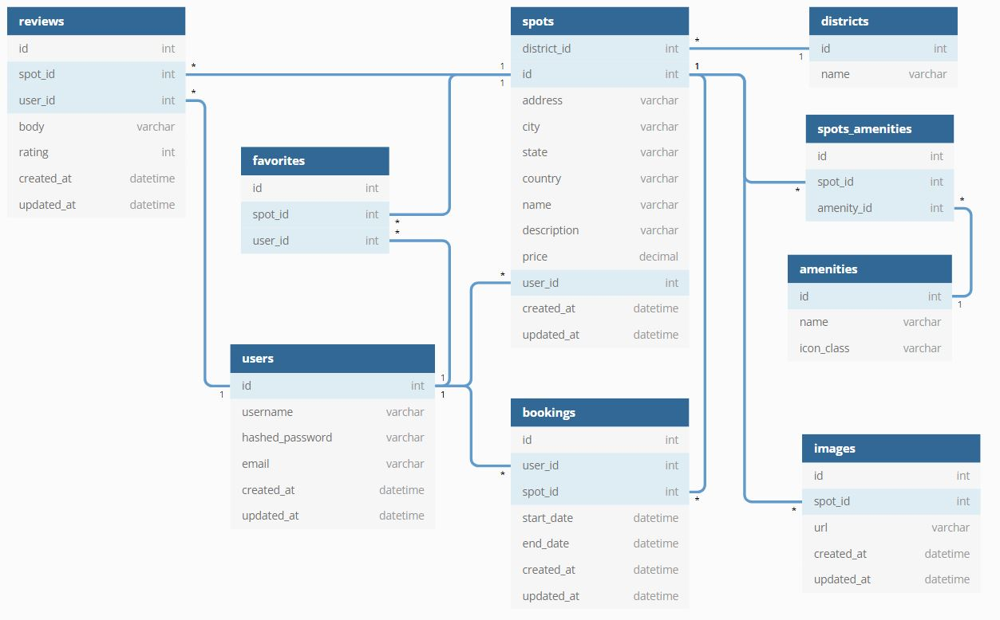

# Night City Bed 'n' Breakfast
Night City BnB is a Cyberpunk-themed clone of [Airbnb](https://www.airbnb.com/). It currently lives on [Heroku](https://night-city-bnb.herokuapp.com).

# Technologies Used

- [React 17](https://17.reactjs.org/)
- [Express 4.x](http://expressjs.com/)
- [Redux 4.x](https://react-redux.js.org/)
- [React-Redux 7.x](https://react-redux.js.org/)
- [Node v16.13.1](https://nodejs.dev/)
- [Sequelize v5](https://sequelize.org/v5/)
- [Postgresql 12.9](https://www.postgresql.org/)
- [HTML5](https://html.spec.whatwg.org/)
- [CSS](https://www.w3.org/Style/CSS/#specs)
- [Javascript](https://developer.mozilla.org/en-US/docs/Web/JavaScript)
- [git](https://git-scm.com/)
- and, of course, [vim](https://www.vim.org/)

# Features

- Navigate via the Nav Bar, the Profile Dropdown, or the Home page cards.
- Create, Edit, Host, and Delete Spots
- View, Search, and Favorite Spots hosted by others
- Leave Reviews for Spots hosted by others
- View and Search your own spots and favorites
- Coming soon: Booking!

# Installation on WSL 2 Ubuntu 16.04 LTS or similar

1. Clone the repo.
2. Run `npm install` from the root directory. This will run `npm install` in both the `frontend` and `backend` directories: see `package.json`
3. A Postgres user must exist with `CREATEDB` and `PASSWORD`. 
    - Username and `PASSWORD` must match environment variables. All required environment variables are listed in `backend/.env.example` — a `.env` file may be used.
    - The backend `PORT` must match the `proxy` in `frontend/package.json`
4. From the `backend` directory, create, migrate, and seed the database with
    - `npx dotenv sequelize db:create`
    - `npx dotenv sequelize db:migrate`
    - `npx dotenv sequelize db:seed:all`
    - `dotenv` may be omitted if regular environment variables are used.
5. Run `npm start` in both `frontend` and `backend` directories, in separate terminals. A webpage will automatically be opened by React.
7. Enjoy!

# Database Schema

